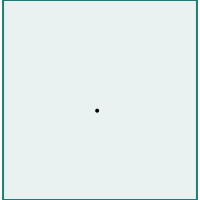
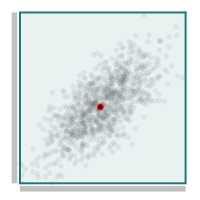

<meta charset='utf-8'> <link rel="stylesheet" href="lhs.css">

scratchpad
----------


<html>
<div class="pic">

<caption align="top">
An abstract square
</caption>


</div>

<div class="pic">

<caption align="top">
1000 correlated dots
</caption>


</div>

<div class="pic">

<caption align="top">
canvas
</caption>


</div>

<div class="pic">

<caption align="top">
axes
</caption>


</div>

<div class="pic">

<caption align="top">
current fave
</caption>


</div>

<div style="clear: both">

</div>

</html>
Rough todo list is:

-   work towards an iconic scatterchart - minimalist design; Axes, ticks
    and ranges that work over any data scale, and render nicely at
    about 200x200.
-   transform data to 1D histograms and work up an iconic bar chart.
-   transform data to 2D hitogram and work up a heatmap/surface/contour
    chart
-   add a line chart
-   add a 1D chart (which might be iso with an axis)
-   add a tiny socket that can:
-   receive new data
-   send mouse clicks

``` {.sourceCode .literate .haskell}
{-# LANGUAGE TypeFamilies #-}
{-# LANGUAGE NoImplicitPrelude #-}
{-# LANGUAGE NoMonomorphismRestriction #-}
{-# LANGUAGE FlexibleContexts #-}
{-# LANGUAGE RankNTypes #-}
{-# OPTIONS_GHC -fno-warn-name-shadowing #-}
{-# OPTIONS_GHC -fno-warn-unused-binds #-}
{-# OPTIONS_GHC -fno-warn-type-defaults #-}
{-# OPTIONS_GHC -fno-warn-unused-imports #-}
{-# OPTIONS_GHC -fno-warn-missing-signatures #-}

import Protolude
import Control.Monad.Primitive (unsafeInlineIO)
import Control.Category (id)
import Data.List (transpose)
import System.IO (FilePath)
import Diagrams.Prelude
import Diagrams.Backend.SVG
import Diagrams.Core.Envelope
```

a random source of data. I usually like to work with (0,1) uniform
variates, or standard normals.

``` {.sourceCode .literate .haskell}
import Random
```

helper libraries
----------------

``` {.sourceCode .literate .haskell}
import Formatting
import qualified Control.Foldl as L
```

I find this a useful technique when testing to avoid having to
instantiate the data and other IO guff all the time in ghci.

``` {.sourceCode .literate .haskell}
xys = unsafeInlineIO (rvcorrL 1000 0.7)
```

main
----

``` {.sourceCode .literate .haskell}

main :: IO ()
main = do 

  padq $
    ( canvas xys
      `atop`
      dots xys # showOrigin
      # axisX xys
      # axisY xys
      # pad 1.1)
  toFile "other/test_001.svg" (200,200) steps1
  toFile "other/test_002.svg" (200,200) (dots xys)
  toFile "other/test_003.svg" (200,200) (canvas xys)
  toFile "other/test_004.svg" (200,200) (axisX xys unitSquare)
  toFile "other/test_005.svg" (200,200)
    ( canvas xys
      `atop`
      dots xys # showOrigin
      # axisX xys
      # axisY xys
      # pad 1.1)
```

This is the main series of steps from the abstract to the concrete, from
left to right:

-   start with a pointful, no origin shape
-   turn it into a Trail
-   close the Trail into a SVG-like loop
-   turn the Trail into a QDiagram

``` {.sourceCode .literate .haskell}
steps1 :: QDiagram SVG V2 Double Any
steps1 = unitSquare # fromVertices # closeTrail # strokeTrail
```

circles in XY space

``` {.sourceCode .literate .haskell}
dots xys =
  atPoints (p2 <$> xys)
    (repeat $ circle 0.1 #
     fcA (rgba (102, 102, 102, 0.1)) #
     lcA (withOpacity black 0) #
     lw none
    )
```

A rectangle located at the exact chart extent, with the same origin. I
use this as a backboard for the actual data area.

*To Do* add crosshairs

``` {.sourceCode .literate .haskell}
canvas xys = extentXYs xys # canvasStyle
canvasStyle =
    showOrigin' (oColor .~ black $ oScale .~ 0.01 $ def)
  # fcA (rgba (30, 120, 120, 0.1))
  # lcA (rgba (30, 120, 120, 1.0))
  # lw veryThick

extentXYs xys = let (minX,maxX,minY,maxY) = range2D xys in
    moveTo (p2 (maxX,minY))
  . strokeTrail
  . closeTrail
  . fromVertices
  . scaleX (maxX-minX)
  . scaleY (maxY-minY)
  $ unitSquare
```

Deciding to make the chart units the same as the data is an important
choice, with the main alternative being leaving the chart units as a
unit (0,1) domain.

axis concepts
-------------

``` {.sourceCode .literate .haskell}
axisx height xs = let (min,max) = range1D xs in
    moveTo (p2 (max,0))
  . strokeTrail
  . closeTrail
  . fromVertices
  . scaleX (max-min)
  . scaleY height
  $ unitSquare

axisy width ys = let (min,max) = range1D ys in
    moveTo (p2 (0,min))
  . strokeTrail
  . closeTrail
  . fromVertices
  . scaleY (max-min)
  . scaleX width
  $ unitSquare

axisStyle =
  fcA (rgba (102, 102, 102, 0.4)) #
  lcA (withOpacity black 0) #
  lw none

axisX xys = (flip (beside (r2 (0,-1)))) $ (axisx 0.2 (fst <$> xys) # axisStyle)
axisY xys = (flip (beside (r2 (-1,0)))) $ (axisy 0.2 (snd <$> xys) # axisStyle)
```

ticks
-----

from d3
-------

``` {.js}
function d3_scale_linearTickRange(domain, m) {
    if (m == null) m = 10;
    var extent = d3_scaleExtent(domain), span = extent[1] - extent[0], step = Math.pow(10, Math.floor(Math.log(span / m) / Math.LN10)), err = m / span * step;
    if (err <= .15) step *= 10; else if (err <= .35) step *= 5; else if (err <= .75) step *= 2;
    extent[0] = Math.ceil(extent[0] / step) * step;
    extent[1] = Math.floor(extent[1] / step) * step + step * .5;
    extent[2] = step;
    return extent;
  }
```

uptohere
========

``` {.sourceCode .literate .haskell}
ticksX = [min, 0, max] where (minX,maxX) = range1D (fst <$> xys)
```

helpers
-------

Quick access to a concrete rendering at various levels of abstraction -
a QDiagram - a Trail - a Path

``` {.sourceCode .literate .haskell}
padq :: QDiagram SVG V2 Double Any -> IO ()
padq t =
  toFile "other/scratchpad.svg" (400,400) t

padt :: Trail V2 Double -> IO ()
padt = padq . strokeTrail

padp :: Path V2 Double -> IO ()
padp = padq . strokePath

hex s = sRGB r b g
  where
    (RGB r g b) = toSRGB $ sRGB24read s
rgba (r,g,b,a) = withOpacity (sRGB (r/255) (g/255) (b/255)) a

toFile :: FilePath -> (Double, Double) -> QDiagram SVG V2 Double Any -> IO ()
toFile name size = renderSVG name (mkSizeSpec (Just <$> r2 size))
```

folds
-----

``` {.sourceCode .literate .haskell}

range2D = L.fold (L.Fold step initial extract)
  where
    step Nothing (x,y) = Just (x,x,y,y)
    step (Just (minX,maxX,minY,maxY)) (x,y) =
      Just (min' x minX, max' x maxX, min' y minY, max' y maxY)
    max' x1 x2 = if x1 >= x2 then x1 else x2
    min' x1 x2 = if x1 <= x2 then x1 else x2
    initial = Nothing
    extract x = case x of
      Nothing -> (-0.5, 0.5, -0.5, 0.5)
      Just x' -> x'

range1D = L.fold (L.Fold step initial extract)
  where
    step Nothing x = Just (x,x)
    step (Just (min,max)) x =
      Just (min' x min, max' x max)
    max' x1 x2 = if x1 >= x2 then x1 else x2
    min' x1 x2 = if x1 <= x2 then x1 else x2
    initial = Nothing
    extract x = case x of
      Nothing -> (-0.5, 0.5)
      Just x' -> x'
```

chart-svg
---------

[](https://travis-ci.org/tonyday567/chart-svg)

Build, run, render readme

    filewatcher '**/*.{lhs,hs,cabal}' 'stack install && readme && pandoc -f markdown+lhs -t html -i readme.lhs -o readme.html && echo "run"' 
