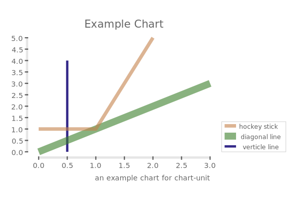
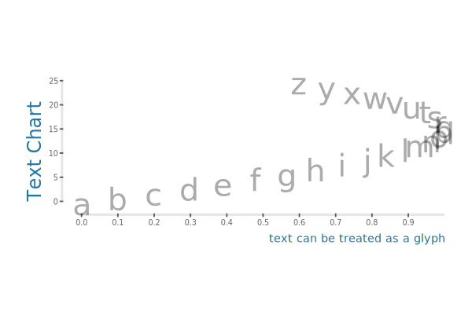
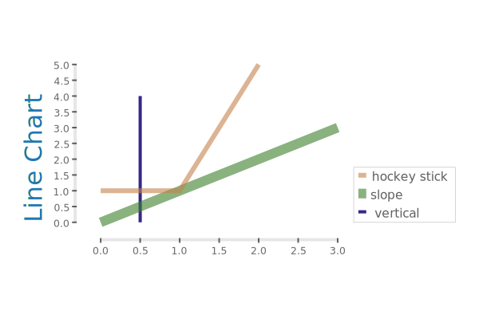
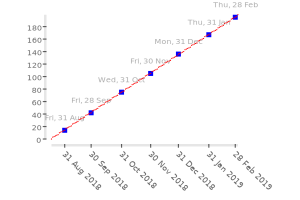
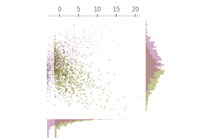
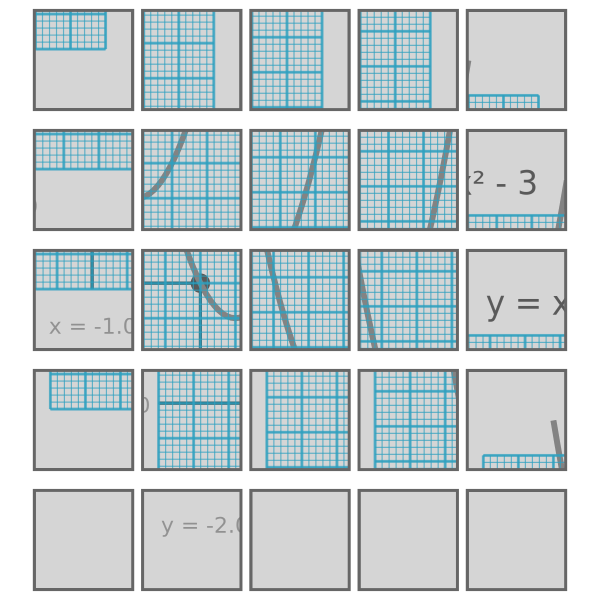
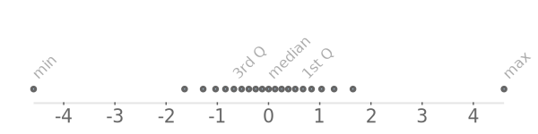

[chart-unit](https://github.com/tonyday567/chart-unit)
===

   

`chart-unit` is a chart library providing a chart ADT, combinators and a small set of high-quality charts using native haskell.

Chart Types
===

The chart types include:

Why the name chart-unit?
===

Most of the behind-the-scenes grunt work is scaling data, projecting points from one range to another, and computing position.  A key to making these computations neat was `one = Range -0.5 0.5` and `one = Rect -0.5 0.5 -0.5 0.5` as the (multiplicative) units of a chart range.  See [numhask-range](https://github.com/tonyday567/numhask-range) for a monologue.

What's with the funny names?
===

Charting is an age-old craft, and stuffed to the brim with cliche and jargon.  I wanted to cut through the cruft of what is thought of as a chart (and charting has been dominated by excel for 30 years), and approach charting from a haskelly perspective.  The funny names were the cohorts that popped out.  A rough translation:

| ye-old Chart type                                    | chart-unit type       |
|------------------------------------------------------|-----------------------|
| line                                                 | LineChart             |
| line chart with markers                              | GLineChart            |
| scatter                                              | GlyphChart            |
| pie                                                  | pull requests welcome |
| heatmap                                              | PixelChart            |
| [Bar](https://en.wikipedia.org/wiki/Bar_chart)       | RectChart             |
| [Histogram](https://en.wikipedia.org/wiki/Histogram) | RectChart             |
| sparkline                                            | a skinny Aspect       |
|                                                      |                       |

Gallery
===

Composable chart types and the power of diagrams make it easy to invent new charts.  Here's some inspiration (all code for these charts is in [examples/gallery.hs](https://github.com/tonyday567/chart-unit/blob/master/examples/gallery.hs)).

grid
---

time
---

`Chart.Data.Time` deals with the scenario where you want to plot a time series consecutively (y values are [0..]) but there are gaps in the seris such as no data on weekend days.

schoolbook
---

From the Haskell survey ...
---

q7
---

q24
---

histogram diff
---

combined scatter histogram
---

clipping
---

skinny
---

tests
===

Differences between text methods, across alignments

workflow
===

~~~
stack build --test --haddock --exec "$(stack path --local-install-root)/bin/chart-unit-source-examples" --exec "$(stack path --local-install-root)/bin/chart-unit-main-example" --exec "$(stack path --local-install-root)/bin/chart-unit-gallery" --exec "$(stack path --local-bin)/pandoc -f markdown -i other/header.md readme.md other/footer.md -t html -o index.html --filter pandoc-include --mathjax" --file-watch
~~~
