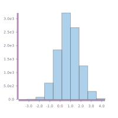

<meta charset="utf-8"> <link rel="stylesheet" href="other/lhs.css">

[](https://github.com/tonyday567/chart-svg)

[](https://travis-ci.org/tonyday567/chart-svg)

Github refuses to render svg in a readme.md, so it all looks much better
in served [html](http://tonyday567.github.io/chart-svg.html).

chart-svg
=========

scratchpad
----------

My newest chart `padq $ linesXY def [[(0,0),(1,1)],[(0,0),(1,2)]]`


chart-svg
---------

This slowly growing collection of svg charts:

-   render nicely over a wide chart size range
-   render similarly at different scale
-   are opinionated minimalism
-   are unit shapes in the spirit of the
    [diagrams](http://projects.haskell.org/diagrams/doc/quickstart.html)
    design space.
-   can be quickly integrated into ad-hoc haskell data analytics,
    providing a visual feedback loop.

charts
------

Scatter


Histogram



Line


Lines


Labelled Bar Chart


``` {.sourceCode .literate .haskell}

{-# LANGUAGE TypeFamilies #-}
{-# LANGUAGE NoImplicitPrelude #-}
{-# LANGUAGE NoMonomorphismRestriction #-}
{-# LANGUAGE FlexibleContexts #-}
{-# LANGUAGE RankNTypes #-}
{-# LANGUAGE GADTs #-}
{-# OPTIONS_GHC -fno-warn-name-shadowing #-}
{-# OPTIONS_GHC -fno-warn-missing-signatures #-}

import Protolude
import Control.Category (id)
import Control.Monad.Primitive (unsafeInlineIO)
import Diagrams.Prelude hiding ((<>))
import Diagrams.Backend.SVG (SVG)
import qualified Control.Foldl as L
import qualified Data.Random as R
import qualified Data.Map.Strict as Map

import Chart
```

some test data
--------------

Standard normal random variates. Called ys to distinguish from the
horizontal axis of the chart (xs) which are often implicitly \[0..\]

``` {.sourceCode .literate .haskell}
ys :: Int -> IO [Double]
ys n =
  replicateM n $ R.runRVar R.stdNormal R.StdRandom
```

A bunch of ys, accumulated.

``` {.sourceCode .literate .haskell}
yss :: (Int, Int) -> [[Double]]
yss (n,m) = unsafeInlineIO $ do
  yss' <- replicateM m $ ys n
  pure $ (drop 1 . L.scan L.sum) <$> yss'
```

xys is a list of X,Y pairs, correlated normal random variates to add
some shape to chart examples.

``` {.sourceCode .literate .haskell}
rXYs :: Int -> Double -> [(Double,Double)]
rXYs n c = unsafeInlineIO $ do
  s0 <- replicateM n $ R.runRVar R.stdNormal R.StdRandom
  s1 <- replicateM n $ R.runRVar R.stdNormal R.StdRandom
  let s1' = zipWith (\x y -> c * x + sqrt (1 - c * c) * y) s0 s1
  pure $ zip s0 s1'

xys = rXYs 1000 0.8
```

XY random walk

``` {.sourceCode .literate .haskell}
rwxy = L.scan (L.Fold (\(x,y) (x',y') -> (x+x',y+y')) (0.0,0.0) id) (take 100 xys)
```

xysHist is a histogram of 10000 one-dim random normals.

The data out is a (X,Y) pair list, with mid-point of the bucket as X,
and bucket count as Y.

``` {.sourceCode .literate .haskell}
xysHist :: [(Double,Double)]
xysHist = unsafeInlineIO $ do
  ys <- replicateM 10000 $ R.runRVar R.stdNormal R.StdRandom :: IO [Double]
  let (first,step,n) = mkTicks' (range1D ys) 100
  let cuts = (\x -> first+step*fromIntegral x) <$> [0..n]
  let mids = (+(step/2)) <$> cuts
  let count = L.Fold (\x a -> Map.insertWith (+) a 1 x) Map.empty id
  let countBool = L.Fold (\x a -> x + if a then 1 else 0) 0 id
  let histMap = L.fold count $ (\x -> L.fold countBool (fmap (x >) cuts)) <$> ys
  let histList = (\x -> Map.findWithDefault 0 x histMap) <$> [0..n]
  return (zip mids (fromIntegral <$> histList))
```

Scale Robustness
----------------

xys rendered on the XY plane as dots - a scatter chart with no axes - is
invariant to scale. The data could be multiplied by any scalar, and look
exactly the same.


Axes break this scale invariance. Ticks and tick labels can hide this to
some extent and look almost the same across scales.


This chart will look the same on a data scale change, except for tick
magnitudes.

main
----

``` {.sourceCode .literate .haskell}

main :: IO ()
main = do
```

See develop section below for my workflow.

``` {.sourceCode .literate .haskell}
  padq $
      linesXY def [[(0,0),(1,1)],[(0,0),(1,2)]]
  toFile "other/line.svg" (200,200) (lineXY def rwxy)
  toFile "other/lines.svg" (200,200) (linesXY def $ zip [0..] <$> yss (1000, 10))
  toFile "other/dots.svg" (100,100) (scatter def xys)
  toFile "other/scatter.svg" (200,200) (scatterXY def xys)
  toFile "other/bar.svg" (200,200) $
    barLabelled def (unsafeInlineIO $ ys 10) (take 10 $ (:[]) <$> ['a'..])
  toFile "other/hist.svg" (200,200) $
    barRange def xysHist
```

diagrams development recipe
---------------------------

In constructing new `units`:

-   diagrams go from abstract to concrete
-   start with the unitSquare: 4 points, 1x1, origin in the center
-   work out where the origin should be, given the scaling needed.
-   turn the pointful shape into a Trail
-   close the Trail into a SVG-like loop
-   turn the Trail into a QDiagram

You can slide up and down the various diagrams abstraction levels
creating transformations at each level. For example, here's something I
use to work at the point level:

``` {.sourceCode .literate .haskell}
unitp f = unitSquare # f # fromVertices # closeTrail # strokeTrail
```

Quick renderer
--------------

``` {.sourceCode .literate .haskell}
padq :: QDiagram SVG V2 Double Any -> IO ()
padq t =
  toFile "other/scratchpad.svg" (400,400) t
```

develop
-------

Hacking

    pandoc -f markdown+lhs -t html -i readme.lhs -o readme.html

Then fire up an intero session, and use padq to display coding results
on-the-fly, mashing the refresh button on a browser pointed to
readme.html.

Build, run, render readme

todo: switch to stack watch

    filewatcher '**/*.{lhs,hs,cabal}' 'stack install && readme && pandoc -f markdown+lhs -t html -i readme.lhs -o readme.html && echo "run"'

Publish

todo: svg2png and change readme.md links to reflect.

    pandoc -f markdown+lhs -t html -i readme.lhs -o ~/git/tonyday567.github.io/other/chart-svg.html && cp other/* ~/git/tonyday567.github.io/other && pandoc -f markdown+lhs -t markdown -i readme.lhs -o readme.md
