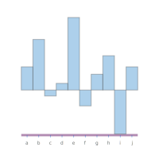

<meta charset="utf-8"> <link rel="stylesheet" href="lhs.css">

chart-svg
---------

scratchpad


Scatter Chart


Line Chart


Labelled Bar Chart



Bar Chart


This is a scratchpad repo for some chart experiments. The scratchpad
usually has whatever I'm up to. Next chart to develop is an area chart.

The aim is a series of charts that

-   render robustly over a wide chart size range
-   render automatically over different data magnitude scales
-   are minimalist
-   have the same vector space as the unit shapes in
    [diagrams](http://projects.haskell.org/diagrams/haddock/index.html)

``` {.sourceCode .literate .haskell}

{-# LANGUAGE TypeFamilies #-}
{-# LANGUAGE NoImplicitPrelude #-}
{-# LANGUAGE NoMonomorphismRestriction #-}
{-# LANGUAGE FlexibleContexts #-}
{-# LANGUAGE RankNTypes #-}
{-# LANGUAGE GADTs #-}
{-# OPTIONS_GHC -fno-warn-name-shadowing #-}
{-# OPTIONS_GHC -fno-warn-unused-binds #-}
{-# OPTIONS_GHC -fno-warn-type-defaults #-}
{-# OPTIONS_GHC -fno-warn-unused-imports #-}
{-# OPTIONS_GHC -fno-warn-missing-signatures #-}

import Protolude
import Control.Monad.Primitive (unsafeInlineIO)
import Control.Category (id)
import Data.List (transpose)
import System.IO (FilePath)
import Diagrams.Prelude hiding ((<>))
import Diagrams.Backend.SVG
import Diagrams.Core.Envelope
```

helper libraries
----------------

``` {.sourceCode .literate .haskell}
import Formatting
import GHC.Base (String)
import qualified Control.Foldl as L
import qualified Data.Vector.Unboxed as V
import qualified Data.Random as R
import Data.Vector.Unboxed  (Vector,(!))
import qualified Data.Vector.Unboxed as VU
import qualified Data.Vector.Mutable as VM
import qualified Data.Vector.Generic as VG
import Data.Primitive.Array
import qualified Data.Map.Strict as Map
```

Chart library
-------------

``` {.sourceCode .literate .haskell}
import Chart
import Chart.Types
```

some test data - a pair of correlated normal random variates. random-fu
has such a clear api for this.

``` {.sourceCode .literate .haskell}
rXYs :: Int -> Double -> IO [(Double,Double)]
rXYs n c = do
  s0 <- replicateM n $ R.runRVar R.stdNormal R.StdRandom
  s1 <- replicateM n $ R.runRVar R.stdNormal R.StdRandom
  let s1' = zipWith (\x y -> c * x + sqrt (1 - c * c) * y) s0 s1
  pure $ zip s0 s1'

xys = unsafeInlineIO $
  fmap (\(x,y) -> (x,y)) <$> rXYs 1000 0.8
xs = fst <$> xys
ys = snd <$> xys

rw2d = L.scan (L.Fold (\(x,y) (x',y') -> (x+x',y+y')) (0.0,0.0) id) (take 100 xys)
rw1d = zip [0..] (L.scan (L.Fold (+) 0.0 id) (take 100 $ xs))

barData :: IO [(Double,Double)]
barData = do
  ys <- replicateM 10000 $ R.runRVar R.stdNormal R.StdRandom :: IO [Double]
  let (first,step,n) = mkTicks True ys 100
  let cuts = (\x -> first+step*fromIntegral x) <$> [0..n]
  let mids = (+(step/2)) <$> (drop (-1) cuts)
  let histMap = L.fold count $ (\x -> L.fold countBool (zipWith (>) (repeat x) cuts)) <$> ys
  let histList = (\x -> Map.findWithDefault 0 x histMap) <$> [0..n]
  return (zip mids (fromIntegral <$> histList))
```

Rendered on the XY plane into a scatter chart with no axes:


Axes break the scale invariance of the above chart (the diagram will
look exactly the same at any data scale change). But ticks and tick
labels can hide this info leakage so that scale invariance continues to
hold.


bar
---

Each bar is a rectangle with height equal to y in (x,y) and placement
equal to x in (x,y). x is often dropped and left to the rendering
assuming equal intervals. x = \[1..\] works for instance


main
----

``` {.sourceCode .literate .haskell}

main :: IO ()
main = do
  -- padq $ barX def (snd <$> barData)
  toFile "other/dots.svg" (100,100) (scatter def xys)
  toFile "other/scatter.svg" (100,100) (scatterXY def xys)
  toFile "other/bar.svg" (200,200) $
    barLabelled def (take 10 $ fst <$> xys) (take 10 $ (:[]) <$> ['a'..])
  barData' <- barData
  toFile "other/hist.svg" (200,200) $
    barRange def barData'
  toFile "other/line.svg" (100,100) (lineXY def rw2d)
```

recipe
------

In constructing new `units`:

-   diagrams go from abstract to concrete
-   start with the unitSquare: 4 points, 1x1, origin in the center
-   work out where the origin should be, given the scaling needed.
-   turn the pointful shape into a Trail
-   close the Trail into a SVG-like loop
-   turn the Trail into a QDiagram

You can slide up and down the various diagrams abstraction levels
creating transformations at each level. For example, here's something I
use to work at the point level:

``` {.sourceCode .literate .haskell}
unitp f = unitSquare # f # fromVertices # closeTrail # strokeTrail
```

Quick renderer
--------------

``` {.sourceCode .literate .haskell}
padq :: QDiagram SVG V2 Double Any -> IO ()
padq t =
  toFile "other/scratchpad.svg" (400,400) t
```

Histogram
---------

``` {.sourceCode .literate .haskell}
hist' cuts xs = L.fold count $ (\x -> L.fold countBool (zipWith (>) (repeat x) cuts)) <$> xs

thist = hist' (tickList' True xs 6) xs

count :: L.Fold Int (Map Int Int)
count = L.Fold step Map.empty id
  where
    step x a = Map.insertWith (+) a 1 x

countBool :: L.Fold Bool Int
countBool = L.Fold (\x a -> x + if a then 1 else 0) 0 id


```

develop
-------

[](https://travis-ci.org/tonyday567/chart-svg)

Build, run, render readme

    filewatcher '**/*.{lhs,hs,cabal}' 'stack install && readme && pandoc -f markdown+lhs -t html -i readme.lhs -o readme.html && echo "run"'

Publish

    pandoc -f markdown+lhs -t html -i readme.lhs -o ~/git/tonyday567.github.io/other/chart-svg.html && cp other/* ~/git/tonyday567.github.io/other && pandoc -f markdown+lhs -t markdown -i readme.lhs -o readme.md
