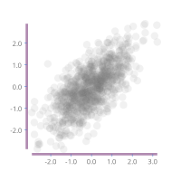
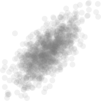

<meta charset="utf-8"> <link rel="stylesheet" href="lhs.css">

[](https://travis-ci.org/tonyday567/chart-svg)

chart-svg
---------

Unless I abandon the svg monomorphism, github fails to render svg in a
markdown format. It all looks much better in served
[html](http://tonyday567.github.io/chart-svg.html).

scratchpad


My last bugfix. `scaleY 0` silently failed and needed to shove a small
number in.

unitSquare \# moveOriginTo (p2 (-0.5,-0.5)) \# scaleY (1e-8) \#
showOrigin

`todo:` QuickCheck for these corner cases.

Currently implemented charts:

Scatter Chart



Histogram


Line Chart


Labelled Bar Chart


To be implemented:

-   one-dimensional chart aka an axis
-   variable-width bar chart (rectangle chart)
-   area chart

Purpose
-------

The aim is a series of charts that

-   utilise svg technology
-   render robustly over a wide chart size range
-   render automatically over different data magnitude scales
-   are minimalist
-   have the same vector space as the unit shapes in
    [diagrams](http://projects.haskell.org/diagrams/haddock/index.html)

The other purpose is to showcase the current precision tool kits that
haskell has to offer the visual data nerd.

``` {.sourceCode .literate .haskell}

{-# LANGUAGE TypeFamilies #-}
{-# LANGUAGE NoImplicitPrelude #-}
{-# LANGUAGE NoMonomorphismRestriction #-}
{-# LANGUAGE FlexibleContexts #-}
{-# LANGUAGE RankNTypes #-}
{-# LANGUAGE GADTs #-}
{-# OPTIONS_GHC -fno-warn-name-shadowing #-}
{-# OPTIONS_GHC -fno-warn-missing-signatures #-}
```

``` {.sourceCode .literate .haskell}

import Protolude
import Control.Category (id)
```

Forgive the IO hiding but I tend to do a lot of one-line experiments in
intero, and this hides the state well for that.

``` {.sourceCode .literate .haskell}
import Control.Monad.Primitive (unsafeInlineIO)
import Diagrams.Prelude hiding ((<>))
import Diagrams.Backend.SVG (SVG)
```

helper libraries
----------------

``` {.sourceCode .literate .haskell}
import qualified Control.Foldl as L
import qualified Data.Random as R
import qualified Data.Map.Strict as Map
```

Chart library
-------------

``` {.sourceCode .literate .haskell}
import Chart
```

some test data
--------------

xys is a list of X,Y pairs, that happen to be correlated normal random
variates.

``` {.sourceCode .literate .haskell}
rXYs :: Int -> Double -> IO [(Double,Double)]
rXYs n c = do
  s0 <- replicateM n $ R.runRVar R.stdNormal R.StdRandom
  s1 <- replicateM n $ R.runRVar R.stdNormal R.StdRandom
  let s1' = zipWith (\x y -> c * x + sqrt (1 - c * c) * y) s0 s1
  pure $ zip s0 s1'

xys = unsafeInlineIO $
  fmap (\(x,y) -> (x,y)) <$> rXYs 1000 0.8

rw2d = L.scan (L.Fold (\(x,y) (x',y') -> (x+x',y+y')) (0.0,0.0) id) (take 100 xys)

xysHist :: [(Double,Double)]
xysHist = unsafeInlineIO $ do
  ys <- replicateM 10000 $ R.runRVar R.stdNormal R.StdRandom :: IO [Double]
```

This piece of code is taking a binned histogram of random one-dim data.
cuts are the edges of the bins, and we reuse mkTicks without a hitch to
regularize the buckets.

The data out is a (X,Y) pair list, with mid-point of the bucket as X,
and bucket count as Y.

``` {.sourceCode .literate .haskell}
  let (first,step,n) = mkTicks True ys 100
  let cuts = (\x -> first+step*fromIntegral x) <$> [0..n]
  let mids = (+(step/2)) <$> cuts
  let histMap = L.fold count $ (\x -> L.fold countBool (fmap (x >) cuts)) <$> ys
  let histList = (\x -> Map.findWithDefault 0 x histMap) <$> [0..n]
  return (zip mids (fromIntegral <$> histList))

count :: L.Fold Int (Map Int Int)
count = L.Fold step Map.empty id
  where
    step x a = Map.insertWith (+) a 1 x

countBool :: L.Fold Bool Int
countBool = L.Fold (\x a -> x + if a then 1 else 0) 0 id


```

the test data is rendered on the XY plane as dots: a scatter chart with
no axes:



Axes break the scale invariance of the above chart (the diagram will
look exactly the same at any data scale change). But ticks and tick
labels can hide this info leakage so that scale invariance continues to
hold.


So this chart will look the same on a data scale change, except for tick
magnitudes.

bar
---

Each bar is a rectangle with height equal to y in (x,y) and placement
equal to x in (x,y). x is often dropped and left to the rendering
assuming equal intervals. x = \[1..\] works for instance


With axes, histograms are natural bar charts.


Note that we have a real x axis, not a label-centric one.

line
----

A 2D random walk:


main
----

``` {.sourceCode .literate .haskell}

main :: IO ()
main = do
```

My workflow, especially when bug hunting, is to keep an intero session
up and fine tune a diagram on the fly, mashing the refresh button on a
browser.

``` {.sourceCode .literate .haskell}
  padq $
      unitSquare # moveOriginTo (p2 (-0.5,-0.5)) # scaleY (1e-8) # showOrigin
  toFile "other/dots.svg" (100,100) (scatter def xys)
  toFile "other/scatter.svg" (200,200) (scatterXY def xys)
  toFile "other/bar.svg" (200,200) $
    barLabelled def (take 10 $ fst <$> xys) (take 10 $ (:[]) <$> ['a'..])
  toFile "other/hist.svg" (200,200) $
    barRange def xysHist
  toFile "other/line.svg" (200,200) (lineXY def rw2d)
```

recipe
------

In constructing new `units`:

-   diagrams go from abstract to concrete
-   start with the unitSquare: 4 points, 1x1, origin in the center
-   work out where the origin should be, given the scaling needed.
-   turn the pointful shape into a Trail
-   close the Trail into a PNG-like loop
-   turn the Trail into a QDiagram

You can slide up and down the various diagrams abstraction levels
creating transformations at each level. For example, here's something I
use to work at the point level:

``` {.sourceCode .literate .haskell}
unitp f = unitSquare # f # fromVertices # closeTrail # strokeTrail
```

Quick renderer
--------------

``` {.sourceCode .literate .haskell}
padq :: QDiagram SVG V2 Double Any -> IO ()
padq t =
  toFile "other/scratchpad.svg" (400,400) t
```

develop
-------

[](https://travis-ci.org/tonyday567/chart-png)

Build, run, render readme

    filewatcher '**/*.{lhs,hs,cabal}' 'stack install && readme && pandoc -f markdown+lhs -t html -i readme.lhs -o readme.html && echo "run"'

Publish

    pandoc -f markdown+lhs -t html -i readme.lhs -o ~/git/tonyday567.github.io/other/chart-svg.html && cp other/* ~/git/tonyday567.github.io/other && pandoc -f markdown+lhs -t markdown -i readme.lhs -o readme.md
